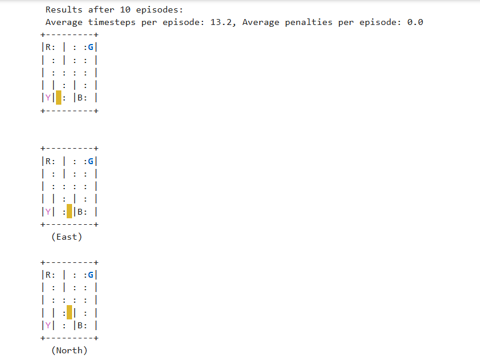
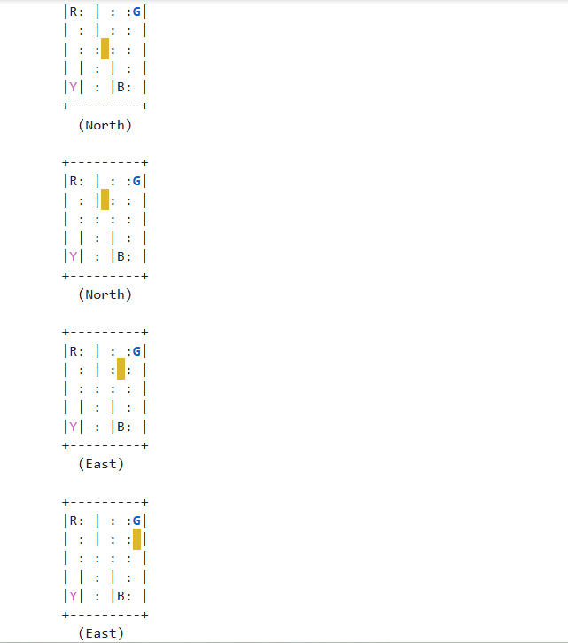
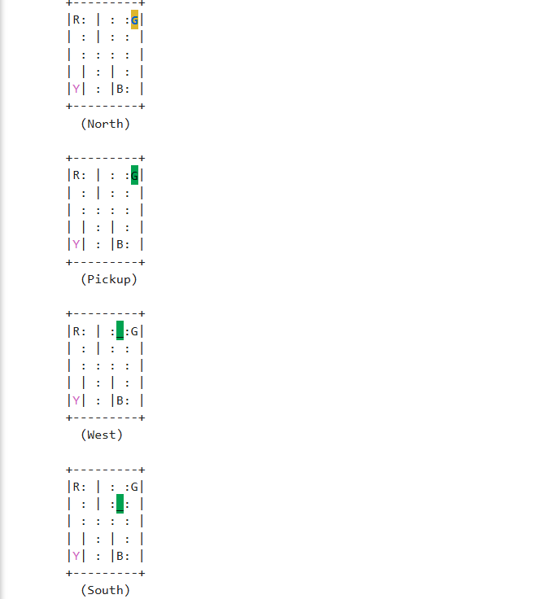
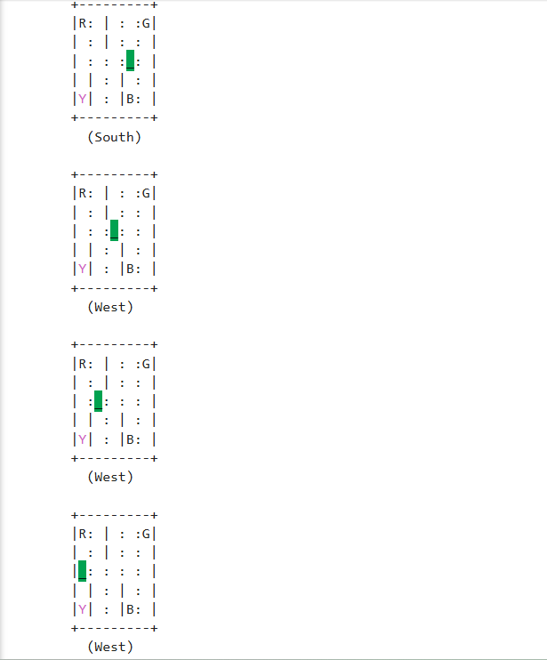
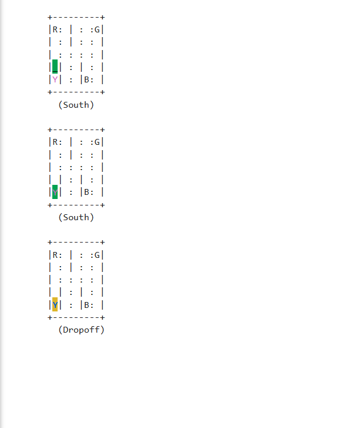

# 🚕 Smart Taxi Driver – Q-learning in OpenAI Gym

This project uses reinforcement learning (Q-learning) to train a taxi agent in the `Taxi-v3` environment from OpenAI Gym.

## 🔍 What It Does
- Uses epsilon-greedy strategy for action selection
- Trains a Q-table over 10,000 episodes
- Evaluates performance using average penalties and steps

## 🖼️ Screenshots

### Final Demo - Start

### Final Demo - Dropoff

## 📈 Results
- Learned to complete episodes with minimal penalties
- Average timesteps: 12.4 | Penalties: 0.2

## 🛠️ Tech Used
- Python
- NumPy
- OpenAI Gym

## 🧠 Key Concepts
- Q-learning update rule
- Exploration vs Exploitation
- Environment interaction via `.step()` and `.render()`
